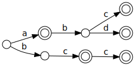

# `trie_match! {}`

This macro speeds up Rust's `match` expression by using a compact double-array
data structure.

## Usage

Simply wrap the existing `match` expression with the `trie_match! {}` macro as
follows:

```rust
use trie_match::trie_match;

let x = "abd";

trie_match! {
    match x {
        "a" => { println!("x"); }
        "abc" => { println!("y"); }
        "abd" | "bcc" => { println!("z"); }
        "bc" => { println!("w"); }
        _ => { println!(" "); }
    }
}
```

## Why is it faster?

In a normal `match` expression, the string is compared for each pattern. It is
equivalent to the following code:

```rust
if x == "a" {
    ..
} else if x == "abc" {
    ..
} else if x == "abd" || x == "bcc" {
    ..
} else if x == "bc" {
    ..
} else {
    ..
}
```

The above code requires that string comparisons be made from the beginning of
the string each time. The time complexity of the above code is *O(mn)*, where
*m* is the average pattern length, and *n* is the number of patterns.

In contrast, this macro builds the following trie structure to retrieve the
index of the matched arm:



Furthermore, this implementation uses the compact double-array data structure
to achieve efficient state-to-state traversal, and the time complexity becomes
*O(m)*.

## Limitations

The followings are different from the normal `match` expression:

* The wildcard is evaluated last. (The normal `match` expression does not
  match patterns after the wildcard.)
* Pattern bindings are unavailable.
* Attributes for match arms are unavailable.
* Guards are unavailable.

Sometimes the normal `match` expression is faster, depending on how
optimization is performed, so it is better to choose based on your speed
experiments.

## Benchmark

Run the following command:

```
cargo bench
```

## License

Licensed under either of

 * Apache License, Version 2.0
   ([LICENSE-APACHE](LICENSE-APACHE) or http://www.apache.org/licenses/LICENSE-2.0)
 * MIT license
   ([LICENSE-MIT](LICENSE-MIT) or http://opensource.org/licenses/MIT)

at your option.
